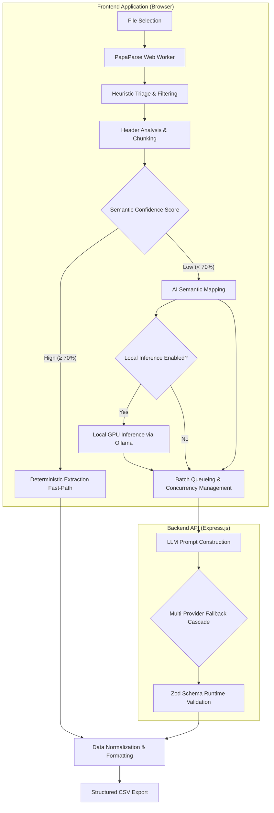

# GridSense

[](https://nextjs.org/)
[](https://expressjs.com/)
[](https://tailwindcss.com/)
[](https://www.typescriptlang.org/)

**GridSense** is an enterprise-grade, hybrid artificial intelligence data ingestion pipeline. It provides a robust, scalable bridge between volatile, unstructured user-generated data (such as arbitrary CSV exports) and strict backend validation systems (such as rigid CRM schemas).

By isolating non-deterministic Large Language Model (LLM) behavior within a tightly controlled deterministic shell, GridSense achieves near-perfect data extraction accuracy without the latency or hallucination risks typically associated with AI-driven parsing.

---

## 1. Project Context & The Data Volatility Problem

In B2B SaaS and enterprise CRM systems, data ingestion is a notoriously brittle process. End-users frequently export data from highly disparate sources, including legacy CRMs, marketing platforms (Facebook Lead Ads, Google Ads), or manually maintained spreadsheets. These exports yield arbitrary column headers, inconsistent date formats, embedded newlines, and scattered contact information.

Traditional ingestion pipelines rely on fixed-schema CSV parsers, which require strict column mapping. When a header changes (e.g., from "Full Name" to "First" and "Last"), or when a phone number is buried within a "Client Notes" column, deterministic parsers silently drop the data or force extensive manual user intervention.

GridSense solves this problem by utilizing semantic AI as a contextual translation layer, governed by rigid schema boundaries.

## 2. The Hybrid Extraction Methodology

GridSense rejects the paradigm of passing raw data files directly into an LLM. Instead, it utilizes a hybrid architecture:

1. **Deterministic Fast-Path**: Standard CSV layout reading, row splitting, concurrency, type coercion, and final data formatting are handled exclusively by compiled, deterministic logic.
2. **Semantic Fallback**: The AI is invoked solely to map unrecognized column headers or extract nested entities (e.g., finding a valid Indian mobile number inside a block of text).
3. **Strict Boundaries**: If the LLM generates a row that does not conform to the predefined `Zod` schema, the payload is rejected and the chunk is retried. Row integrity is strictly preserved; input arrays are mapped back to their original indexes, guaranteeing that no data is silently dropped, duplicated, or hallucinated by the AI.

## 3. System Architecture & Data Flow



## 4. Key Technical Innovations

### Adaptive Client-Side Chunking
Offloading initial parsing and chunking to the client prevents the backend from managing large, stateful file uploads. The backend remains stateless, receiving small, easily processed JSON payloads. Passing a 10,000-row CSV into an LLM context window results in immediate failure due to token limits; chunking into localized 20-50 row batches ensures high mapping accuracy.

### Dynamic Multi-Provider Fallback
Relying on a single AI provider guarantees failure during load spikes or API outages. GridSense features a dynamic cascade fallback system. If a `429 Too Many Requests` or `503 Service Unavailable` error is encountered (e.g., on Groq), the pipeline seamlessly cycles the failed batch to the next available provider (Gemini, OpenRouter) without surfacing the network failure to the end-user.

### Privacy-First Local Inference (Ollama)
For environments handling highly sensitive PII (Personally Identifiable Information) or strict compliance requirements (GDPR/HIPAA), GridSense supports zero-cost, 100% local inference. When enabled, the browser intercepts AI requests and routes them directly to the user's local GPU daemon, bypassing cloud providers entirely.

### Zod Runtime Boundaries
TypeScript provides compile-time safety, but an LLM response is inherently untyped runtime data. GridSense enforces a strict runtime boundary using `Zod`. The pipeline guarantees that any data re-entering the deterministic flow matches the exact target interfaces, stripping invalid keys and coercing types before serialization.

---

## 5. Local Development & Deployment

The project operates as a unified monorepo containing both the Next.js client and the Express.js API server.

### Prerequisites
- Node.js (v18+)
- Local Ollama Daemon (Optional, for local inference)

### Repository Setup

```bash
# Clone the repository
git clone https://github.com/notUbaid/GridSense.git
cd GridSense

# Install dependencies across the monorepo
npm ci
cd frontend && npm ci
cd backend && npm ci

# Configure environment variables
cp .env.example .env
```

### Running the Application

To run both the frontend and backend servers concurrently:
```bash
npm run dev
```

### Environment Variables
For cloud-based AI inference, the following secrets must be configured in `.env`:
- `GROQ_API_KEY`
- `GEMINI_API_KEY`
- `OPENAI_API_KEY` (Optional)
- `ANTHROPIC_API_KEY` (Optional)

*(Note: API keys are not required if you exclusively utilize the Local Inference execution path).*

---

## 6. Local AI Configuration (Ollama)

To utilize GridSense's local inference capabilities, you must configure your local Ollama daemon to accept cross-origin requests from the web application.

1. Ensure [Ollama](https://ollama.com/) is installed and running.
2. Download a high-performance quantized model (e.g., `gemma3` or `llama3`):
   ```bash
   ollama run gemma3:latest
   ```
3. **Enable CORS Parameters**:
   Modern browsers block local requests from external web origins for security. You must launch the daemon with the appropriate CORS overrides.

   **macOS / Linux:**
   ```bash
   OLLAMA_ORIGINS="*" ollama serve
   ```
   
   **Windows (PowerShell):**
   ```powershell
   $env:OLLAMA_ORIGINS="*"
   ollama serve
   ```

4. Within the GridSense application UI, toggle the local inference setting (the microchip icon). All extraction workloads will instantly route to your local hardware.

---

## 7. Testing & Quality Assurance

The backend architecture includes a comprehensive Vitest suite designed to validate the extraction logic without consuming live API tokens. The testing environment utilizes an injected mock AI provider to guarantee deterministic execution of the pipeline logic during CI/CD.

```bash
npm run test:backend
```

The validation strategy relies on asserting that the `processBatch` controller correctly parses, sanitizes, and maps varying structural inputs into the exact 15-field CRM schema under varied load and error conditions.

---

*Built for the GrowEasy Software Developer Internship Evaluation.*
