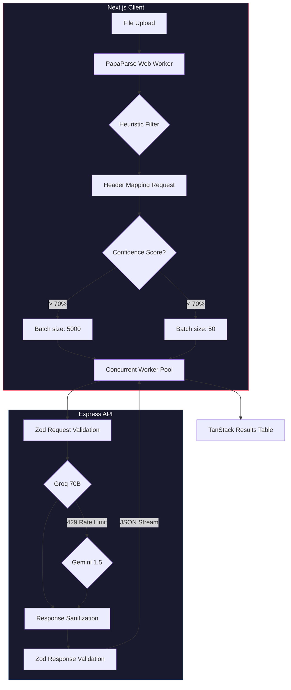

<div align="center">
  
  <h1>GridSense</h1>
  <p><strong>Enterprise-Grade CSV → CRM AI Ingestion Pipeline</strong></p>

  <p>
    <a href="https://grid-sense-ge.vercel.app"></a>
  </p>
  <p>
    
    
    
    
  </p>
</div>

<br />

> GridSense is a production-hardened extraction and transformation engine. Upload any CSV — Facebook leads, Google Ads exports, real estate CRMs, or hand-typed spreadsheets — and GridSense intelligently maps messy, unstructured columns into a strictly typed GrowEasy CRM schema with zero manual configuration.

---

## 🧠 The Engineering Philosophy

Large Language Models (LLMs) are incredibly powerful, but inherently unpredictable, slow at scale, and prone to hallucinations. GridSense solves this by wrapping AI processing in **strict validation boundaries, intelligent batching, and highly resilient state management**.

GridSense does not trust the AI. Every interaction is strictly validated. We prioritize engineering quality over raw implementation speed.

---

## 🔄 The Request Flow (How It Actually Works)

Here is the exact step-by-step technical flow of the application when processing a dataset.

### Phase 1: Client-Side Triage

1. **Upload & Local Parse**: The user uploads an arbitrary file (e.g., `facebook_leads.csv`). Nothing AI-related happens yet. `PapaParse` runs fully client-side in the browser via Web Workers to convert the CSV into a JSON array. This prevents server memory bloat and massive upload payloads.
2. **Heuristic Deduplication**: The frontend runs a deterministic pre-flight check. If a row lacks an `@` symbol or at least 7 numerical digits (potential phone number), it is immediately discarded as garbage data before we ever pay for API tokens.

### Phase 2: Schema Mapping & Execution Strategy

3. **Column Inference**: The frontend extracts the column headers and pings the backend `map-headers` route.
4. **AI Architect**: The backend asks Groq (Llama-3.1-8B) to map the unknown columns (e.g., `Customer Name`, `Remarks`, `Status`) to our strict schema (`name`, `crm_note`, `crm_status`). The AI assigns a confidence score to its mapping.
5. **The Fork in the Road**:
   - **High Confidence (≥ 70%)**: If the mapping is nearly perfect, we switch to **Deterministic Extraction Mode**. We process 5,000 rows at a time synchronously without hitting the AI again.
   - **Low/No Confidence**: If the headers are absolute garbage, we switch to **AI Extraction Mode**. We chunk the data into highly constrained batches of 50 rows.

### Phase 3: The Concurrent Worker Pool

6. **Chunking & Concurrency**: Sending 500 rows to an LLM at once destroys the context window, causes hallucinations, and hits rate limits. Instead, the frontend uses a concurrent worker pool (max concurrency: 4) to dispatch 50-row batches asynchronously.
7. **Backend Prompt Construction**: The Express backend dynamically constructs the prompt, embedding the specific chunk and enforcing strict JSON output using `zod-to-json-schema`.

### Phase 4: Multi-Provider Resilience & Validation

8. **Primary Inference (Groq)**: The prompt is sent to Groq (`llama-3.3-70b-versatile`) for extreme-speed inference.
9. **Synchronous Fallback**: If Groq hits a `429 Rate Limit`, the backend automatically catches it, swaps the API endpoint, and fails over to Google Gemini (`gemini-2.5-flash`) to salvage the batch.
10. **Zero-Hallucination Validation**: The LLM returns a JSON string. The backend parses it, strips rogue Markdown fences, and pushes it through a Zod schema validator. If the AI hallucinated an enum value (e.g., `crm_status: 'KIND_OF_INTERESTED'`), it is clamped to `null`. If it dropped rows, the batch fails and is queued for retry.

### Phase 5: Live Streaming & Consolidation

11. **Real-Time UI**: As the asynchronous workers resolve, the React frontend streams the progress to a live dashboard, dynamically updating ETA and elapsed time.
12. **Final Export**: The normalized data is rendered in a virtualized TanStack Table. The user exports a clean, UTF-8 BOM encoded CSV (fully compatible with Microsoft Excel).

---

## 🏗️ Architecture & Stack



### Tech Stack

- **Frontend**: Next.js 16, React 19, Tailwind CSS v4, Framer Motion, Shadcn UI, TanStack Table, PapaParse.
- **Backend**: Node.js, Express, Zod, Pino Logger, Groq SDK, Google Generative AI SDK.
- **Quality Assurance**: Vitest (Integration Testing), ESLint, Prettier, Husky.

---

## 🛡️ Release Hardening & Audits

GridSense recently underwent a comprehensive engineering audit, resulting in major hardening across the stack:

- **Race Conditions Eliminated**: Refactored concurrent provider switching logic to assign providers at dequeue-time rather than mutating shared closure state.
- **Memory Leaks Sealed**: Implemented proper `useRef` cleanup for timing intervals and `URL.revokeObjectURL()` garbage collection for Blob exports.
- **AI Context Management**: Hard-capped AI batch sizes to 50 rows to prevent massive token overflow, while preserving 5000-row batches for deterministic mapping.
- **Secure Secrets Management**: Scrubbed plaintext API keys and implemented strict `.env` exclusions in `.gitignore`.
- **Traceability**: Injected `x-request-id` header tracking into the Express error middleware for structured, traceable production logs.

---

## 🚀 Quick Start

### 1. Prerequisites

- Node.js (v20+)
- npm

### 2. Installation

```bash
git clone https://github.com/notUbaid/GridSense.git
cd GridSense

# Install backend dependencies
cd backend && npm install

# Install frontend dependencies
cd ../frontend && npm install
```

### 3. Environment Setup

Copy the example environment file in the root directory to the backend:

```bash
cp .env.example backend/.env
```

Open `backend/.env` and add your API keys:

- `GROQ_API_KEY=your_key` (Get one at [console.groq.com](https://console.groq.com))
- `GEMINI_API_KEY=your_key` (Get one at [aistudio.google.com](https://aistudio.google.com))

### 4. Running Locally

You will need two terminal windows.

**Terminal 1 (Backend):**

```bash
cd backend
npm run dev
```

**Terminal 2 (Frontend):**

```bash
cd frontend
npm run dev
```

Visit `http://localhost:3000` in your browser.

---

## 🧪 Testing

The backend includes a comprehensive Vitest suite that utilizes a `MockAIProvider` to ensure deterministic execution of the pipeline without consuming real API tokens.

```bash
cd backend
npm run test
```

---

<div align="center">
  <p>Built for the GrowEasy Software Developer Internship Evaluation.</p>
</div>
