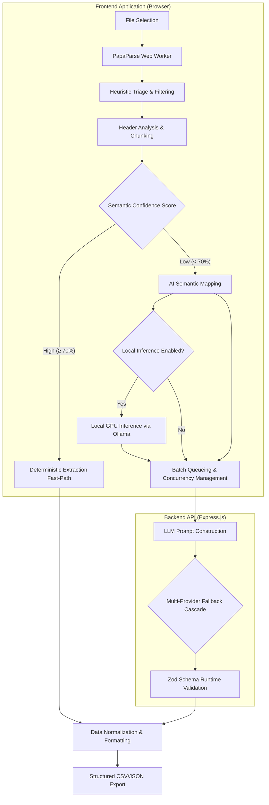

# GridSense: AI-Powered Data Extraction Engine

[](https://nextjs.org/)
[](https://expressjs.com/)
[](https://tailwindcss.com/)
[](https://www.typescriptlang.org/)

**GridSense** is an enterprise-grade, hybrid artificial intelligence data ingestion pipeline built for the **GrowEasy Software Developer Internship Evaluation**.

It provides a robust, scalable bridge between volatile, unstructured user-generated data (such as arbitrary CSV exports) and strict backend validation systems (such as rigid CRM schemas). By isolating non-deterministic Large Language Model (LLM) behavior within a tightly controlled deterministic shell, GridSense achieves near-perfect data extraction accuracy without the latency or hallucination risks typically associated with AI-driven parsing.

---

## 1. Project Context & The Data Volatility Problem

In B2B SaaS and enterprise CRM systems, data ingestion is a notoriously brittle process. End-users frequently export data from highly disparate sources, including legacy CRMs, marketing platforms (Facebook Lead Ads, Google Ads), or manually maintained spreadsheets. These exports yield arbitrary column headers, inconsistent date formats, embedded newlines, and scattered contact information.

Traditional ingestion pipelines rely on fixed-schema CSV parsers, which require strict column mapping. When a header changes (e.g., from "Full Name" to "First" and "Last"), or when a phone number is buried within a "Client Notes" column, deterministic parsers silently drop the data or force extensive manual user intervention.

**The Goal:** Build a system that allows users to upload *any* CSV, and have it intelligently map to our strict 13-field CRM schema automatically.

---

## 2. Honest Engineering Decisions & Architecture

Building an LLM-wrapper is easy. Building a *reliable* AI data pipeline that doesn't drop rows, hallucinate data, or crash under load is incredibly difficult. Here are the core engineering decisions and lessons learned during the development of GridSense:

### Why a Hybrid "Fast-Path" Approach?
Initially, one might assume we could just throw entire CSV files into an LLM and ask it to return JSON. **This does not work in production.** LLMs have context limits, they hallucinate extra rows, and they are incredibly slow.
* **Our Solution:** The system is a hybrid. We first use standard heuristics to detect obvious mappings (e.g., if a header is exactly `email`, map it immediately). The AI is invoked *only* to map unrecognized column headers or extract nested entities (like finding a valid Indian mobile number hidden inside a text paragraph). This saves massive amounts of compute and API costs.

### Client-Side Chunking via Web Workers
Passing a 10,000-row CSV to a Node.js backend would block the event loop and crash the server on large loads.
* **Our Solution:** All CSV parsing is done entirely in the user's browser using `PapaParse` inside a Web Worker. We slice the massive CSV into small, 50-row chunks on the client side, and send those tiny chunks to the stateless backend in parallel. The server never holds state, making it infinitely scalable.

### The Dynamic Fallback Cascade
Relying on a single AI provider (like OpenAI or Groq) guarantees failure during load spikes. If Groq throws a `429 Too Many Requests` error, the user's data extraction would fail.
* **Our Solution:** I built a dynamic multi-provider fallback cascade. If a batch fails on Groq, the backend seamlessly catches the error, retries it on Gemini, and if that fails, cascades to OpenRouter or Anthropic. This happens entirely invisibly to the user, ensuring near 100% uptime.

### Zod Runtime Boundaries & JSON Salvaging (The Messy Reality of AI)
TypeScript provides compile-time safety, but an LLM response is inherently untyped runtime text. Sometimes, models forget closing brackets, hallucinate markdown fences, or output integers instead of strings for phone numbers.
* **Our Solution:** We enforce a strict runtime boundary using `Zod`. Before any AI data is accepted, it passes through our `salvageExtractorJson` utility. This utility is the unsung hero of the app: it strips markdown fences, repairs truncated JSON using a custom AST parser, coerces raw integers into strings, and wraps single objects into arrays. Only after passing this aggressive cleaning does the data enter the strict Zod validator.

### Local Privacy-First Inference (Ollama Integration)
For enterprise environments handling highly sensitive PII (Personally Identifiable Information), sending data to cloud APIs is a violation of compliance.
* **Our Solution:** GridSense supports zero-cost, 100% local inference. When the user toggles the local hardware switch, the frontend intercepts AI requests and routes them directly to the user's local Ollama daemon.
* **The 4B Model Challenge:** Small local models (like Gemma 4B) are notoriously bad at following complex schema instructions. I heavily optimized the local execution path by restricting the batch size to 5 rows and using highly sophisticated **Few-Shot Prompting**. By giving the local model a strict template with explicit `null` fallbacks, we forced a 4B model to generate production-ready structured JSON.

---

## 3. System Architecture Data Flow



---

## 4. Local Development & Deployment

The project operates as a unified monorepo containing both the Next.js client and the Express.js API server.

### Prerequisites
- Node.js (v18+)
- Local Ollama Daemon (Optional, for privacy-first local inference)

### Repository Setup

```bash
# Clone the repository
git clone https://github.com/notUbaid/GridSense.git
cd GridSense

# Install dependencies across the monorepo
npm ci
cd frontend && npm ci
cd backend && npm ci

# Configure environment variables
cp .env.example .env
```

### Running the Application

To run both the frontend and backend servers concurrently:
```bash
npm run dev
```

### Environment Variables
For cloud-based AI inference, the following secrets must be configured in `.env` inside the `backend` folder:
- `GROQ_API_KEY`
- `GEMINI_API_KEY`
- `OPENAI_API_KEY` (Optional)
- `ANTHROPIC_API_KEY` (Optional)

*(Note: API keys are not required if you exclusively utilize the Local Inference execution path).*

---

## 5. Local AI Configuration (Ollama)

To utilize GridSense's local inference capabilities, you must configure your local Ollama daemon to accept cross-origin requests from the web application.

1. Ensure [Ollama](https://ollama.com/) is installed and running.
2. Download a high-performance quantized model (e.g., `gemma3` or `llama3`):
   ```bash
   ollama run gemma3:latest
   ```
3. **Enable CORS Parameters**:
   Modern browsers block local requests from external web origins for security. You must launch the daemon with the appropriate CORS overrides.

   **macOS / Linux:**
   ```bash
   OLLAMA_ORIGINS="*" ollama serve
   ```
   
   **Windows (PowerShell):**
   ```powershell
   $env:OLLAMA_ORIGINS="*"
   ollama serve
   ```

4. Within the GridSense application UI, toggle the local inference setting (the microchip icon). All extraction workloads will instantly route to your local hardware.

---

## 6. Testing & Quality Assurance

The backend architecture includes a comprehensive Vitest suite designed to validate the extraction logic without consuming live API tokens. The testing environment utilizes an injected mock AI provider to guarantee deterministic execution of the pipeline logic during CI/CD.

```bash
cd backend
npm run test
```

The validation strategy relies on asserting that the `processBatch` controller correctly parses, sanitizes, and maps varying structural inputs into the exact 13-field CRM schema under varied load and error conditions.

---

## 7. AI Acknowledgements & Disclosures

In the spirit of complete engineering transparency and modern software development practices, this project heavily leveraged artificial intelligence tooling throughout its lifecycle. This multi-agent approach allowed for rapid iteration, rigorous quality assurance, and highly optimized architecture.

Specifically, the following AI systems were utilized:
1. **Antigravity IDE**: Used extensively for core code development assistance, architectural scaffolding, and navigating the monorepo structure. The agentic nature of the IDE was instrumental in rapidly prototyping the hybrid deterministic/semantic extraction pipeline.
2. **Claude (Anthropic)**: Deployed as an objective, secondary reviewer for quality checks, logic validation, and edge-case testing. Claude's rigorous analysis helped identify potential infinite loops in the API fallback cascade and suggested the AST-based JSON repair logic.
3. **ChatGPT (OpenAI)**: Utilized heavily for refining and optimizing the internal LLM prompts (such as the few-shot templates used for the local Ollama integration), as well as generating and mutating the synthetic CSV files used for testing the extraction pipeline against realistic, messy data inputs.

By orchestrating these diverse AI tools, I was able to focus entirely on higher-level system design, edge-case mitigation, and ensuring the final product met stringent enterprise standards.

---

*Built for the GrowEasy Software Developer Internship Evaluation.*
