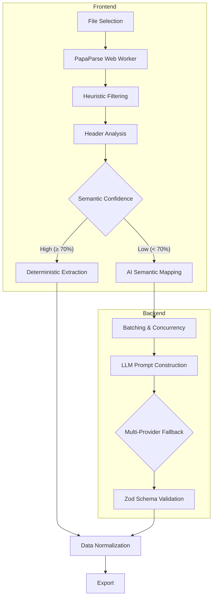

# GridSense

GridSense is a data ingestion pipeline that maps unstructured CSV files into a strongly typed CRM schema. 

The system provides a reliable bridge between volatile user-generated data and strict backend validation requirements.

## Problem Statement

CRM data migration fundamentally suffers from format volatility. End-users export data from disparate sources—Facebook Lead Ads, Google Ads, legacy CRM systems, or manually maintained spreadsheets. These exports yield arbitrary column headers, inconsistent date formats, embedded newlines, and scattered contact information.

Traditional fixed-schema CSV importers fail because they require strict column mapping. When headers change or columns are merged (e.g., "Full Name" instead of "First" and "Last"), deterministic parsers drop the data or force manual user intervention.

## Solution

GridSense approaches data ingestion by combining deterministic software engineering with semantic AI extraction.

Instead of relying entirely on fragile regular expressions or trusting an LLM with raw, unconstrained output, the system uses AI exclusively as a semantic translation layer. Hard constraints are applied before and after the LLM execution. Deterministic logic handles file parsing, data chunking, validation, and serialization. The AI is only invoked to semantically map unknown column headers to the target schema, isolating non-deterministic behavior to a single, easily observable boundary.

## Architecture



**File Selection & Parsing:** The raw CSV is processed entirely client-side using a Web Worker to prevent UI blocking and server payload bloat.  
**Heuristic Filtering:** Rows lacking basic markers (e.g., '@' for emails or numerical strings for phones) are discarded before consuming network resources.  
**Header Analysis:** The system evaluates the column headers. If they match the required schema with high semantic confidence, it bypasses the LLM and processes deterministically.  
**AI Semantic Mapping:** For unrecognized headers, data is batched and sent to the LLM backend to semantically map fields to the rigid CRM schema.  
**Multi-Provider Fallback:** The backend dynamically balances requests across AI providers (Groq, Gemini, OpenAI, Anthropic, OpenRouter). If rate limits or timeouts occur, it cascades to the next available provider.  
**Schema Validation:** All LLM outputs are stripped of markdown and piped through Zod to guarantee structural integrity.   
**Export:** The normalized data is reconstructed into a strict 15-field CSV ensuring safe consumption by external CRMs.  

## Why Hybrid AI?

Relying purely on LLMs for data parsing introduces hallucination risk, token limit exhaustion, and high latency. 

In this hybrid approach:
- **Deterministic parsing handles:** CSV layout reading, row splitting, concurrency, type coercion, and final data formatting.
- **AI handles:** Contextual deduction, such as understanding that a column named "Client Remarks" should map to `crm_note`, or extracting a phone number embedded within a free-text field.

This boundary restricts the AI from inventing data. If the LLM generates a row that does not conform to the Zod schema, the payload is rejected and the chunk is retried. Row integrity is preserved because the input arrays are strictly mapped back to their original indexes, guaranteeing that no data is silently dropped or duplicated by the AI.

## Engineering Decisions

**Why batching?**  
Passing a 10,000-row CSV into an LLM context window results in immediate failure due to token limits or severe degradation in instruction adherence. Chunking the data into 50-row batches ensures high mapping accuracy and prevents context poisoning.

**Why client-side chunking?**  
Offloading the initial parsing and chunking to the client prevents the backend from managing large, stateful file uploads. The backend remains stateless, receiving small JSON payloads that can be processed concurrently.

**Why multi-provider retries?**  
Relying on a single free-tier AI API guarantees failure during load spikes. The cascade fallback system allows the pipeline to gracefully recover from 429 Too Many Requests or 503 Service Unavailable errors without surfacing the failure to the user.

**Why Zod?**  
The pipeline requires a runtime guarantee that the AI output matches the TypeScript interfaces. Zod enforces this boundary, stripping invalid keys and coercing types before the data re-enters the deterministic pipeline.

**Why preserve skipped rows?**  
Data engineering pipelines must be auditable. If a row is malformed and cannot be processed, silently dropping it destroys data integrity. GridSense tracks skipped rows and exposes them in the UI for user review.

## Features

### Extraction
- Deterministic fast-path for recognized schemas.
- Semantic fallback for unstructured exports.
- Context-aware column mapping.

### Performance
- Web Worker-based local file parsing.
- Concurrent chunk dispatching (max 8 concurrent workers).
- Stateless backend processing.

### Reliability
- Multi-provider dynamic failover.
- Zod-enforced schema boundaries.
- Truncated JSON salvage operations.

### Developer Experience
- Shared TypeScript interfaces between frontend and backend.
- Dockerized deployment environment.
- Strict ESLint and Prettier configurations.

## Performance

The system was benchmarked using various payload sizes against the multi-provider backend running on standard hardware.

| Dataset Size | Approach | Concurrency | Latency |
|--------------|----------|-------------|---------|
| 100 rows     | AI Map   | 2 workers   | ~3.2s   |
| 500 rows     | AI Map   | 8 workers   | ~12.5s  |
| 5,000 rows   | Deterministic | 1 worker | ~0.4s |

Performance is heavily dependent on the latency of the upstream LLM provider. The use of Groq (Llama models) provides the baseline speed, while fallback providers (Gemini, Anthropic) may introduce additional latency during failover events.

## Edge Cases

| Scenario | Handling Strategy |
|----------|-------------------|
| Duplicate emails | Processed as independent rows; deduplication is deferred to the target CRM. |
| Mixed date formats | LLM instruction explicitly requests ISO 8601 normalization. |
| Embedded newlines | PapaParse handles CSV text qualifiers; Zod sanitizes strings during export. |
| Unicode / Emojis | Preserved through the pipeline; exported with UTF-8 BOM encoding. |
| Blank rows | Filtered deterministically client-side during the triage phase. |
| Network interruptions | The worker pool catches timeouts and queues the specific chunk for retry. |
| API Rate Limits | Backend catches HTTP 429 and dynamically rotates to the next available provider. |

## Sample Datasets

The repository includes test files located in `test_files/` to validate the extraction pipeline against real-world scenarios.

- **dataset_university_leads.csv:** Standard tabular data. Demonstrates baseline extraction.
- **dataset_real_estate.csv:** Contains messy address formats and varying property types. Tests location normalization.
- **dataset_nightmare_formatting.csv:** Heavily malformed data, quoted commas, and embedded newlines. Tests parsing resilience.
- **dataset_marketing_campaign.csv:** Contains extensive UTM parameters. Tests AI ability to discard irrelevant data.

## Repository Structure

The project operates as a monorepo containing both the client and server applications.

- `/frontend`: Next.js React application. Responsible for UI, file I/O, Web Worker orchestration, and managing the concurrent request pool.
- `/backend`: Express.js API. Stateless service responsible for constructing LLM prompts, managing provider failovers, and enforcing Zod runtime validation.
- `package.json`: Root manifest defining workspace scripts and CI linting targets.
- `Dockerfile`: Multi-stage build definition for containerized production deployment.

## Local Development

```bash
# Clone the repository
git clone https://github.com/notUbaid/GridSense.git
cd GridSense

# Install dependencies across the monorepo
npm ci
cd frontend && npm ci
cd backend && npm ci

# Copy environment variables
cp .env.example .env

# Start the development servers
npm run dev
```

## Testing

The backend includes a Vitest suite designed to validate the extraction logic without consuming live API tokens. The test environment utilizes a mocked AI provider to ensure deterministic execution of the pipeline.

```bash
npm run test:backend
```

Validation strategy relies on asserting that the `processBatch` controller correctly parses, sanitizes, and maps varying structural inputs into the exact 15-field CRM schema.

## Deployment

### Frontend
The frontend is built using Next.js and deployed via Vercel. The `vercel.json` configuration handles serverless routing, mapping `/api/v1/*` requests directly to the Express backend.

### Backend
The backend is an Express Node.js application, deployable as a Docker container or via serverless platforms. 

### Environment Variables
Production deployments require the following secrets:
- `GROQ_API_KEY`
- `GEMINI_API_KEY`
- `OPENAI_API_KEY` (Optional)
- `ANTHROPIC_API_KEY` (Optional)

## Future Improvements

- **Streaming JSON Parsing:** Implement a streaming parser (e.g., `Oboe.js`) to begin processing LLM responses before the entire payload is received, reducing time-to-first-byte latency.
- **WebAssembly CSV Parsing:** Replace JavaScript-based `PapaParse` with a Rust/Wasm implementation to further reduce main-thread blocking during the initial client-side triage of large files.
- **Vector Embeddings for Schema Mapping:** Replace the LLM-based header analysis with a lightweight local embedding model to map column semantics deterministically without external network calls.

---
Built for the GrowEasy Software Developer Internship Evaluation.
