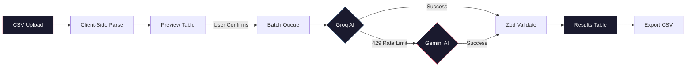

<div align="center">
  <h1>GridSense</h1>
  <p><strong>AI-Powered CSV → CRM Schema Mapper</strong></p>

  <p>
    <a href="https://grid-sense-ge.vercel.app"></a>
  </p>
  <p>
    <a href="https://github.com/notUbaid/GridSense"></a>
    <a href="https://github.com/notUbaid/GridSense"></a>
    <a href="https://github.com/notUbaid/GridSense"></a>
    <a href="https://github.com/notUbaid/GridSense"></a>
    <a href="https://github.com/notUbaid/GridSense"></a>
    <a href="https://github.com/notUbaid/GridSense"></a>
  </p>
</div>

<br />

> GridSense is a production-grade extraction and transformation engine. Upload any CSV — Facebook leads, Google Ads exports, real estate CRMs, or hand-typed spreadsheets — and the AI will intelligently map messy, unstructured columns into a strictly typed GrowEasy CRM schema with zero manual configuration.

---

## Architecture



| Layer | Technologies |
| :--- | :--- |
| **Frontend** | Next.js 16, React 19, Tailwind CSS v4, Framer Motion, Shadcn UI, TanStack Table |
| **Backend** | Node.js, Express, Zod, Pino, Groq SDK, Google Generative AI |
| **Testing** | Vitest (Integration & Unit), MockAIProvider |
| **CI/CD** | GitHub Actions, ESLint, Prettier, Husky, Lint-Staged, Vercel |
| **Infra** | Docker, Docker Compose |

<br />

## Engineering Highlights

### Dual-AI Fallback System
The backend primarily uses **Groq** (`llama-3.3-70b-versatile`) for extreme-speed inference. If Groq encounters a `429 Too Many Requests` rate limit, the system gracefully traps the error and seamlessly hands off to **Google Gemini** (`gemini-1.5-flash`), eliminating data drop-offs.

### Smart Batch Processing Pipeline
Large datasets are dynamically chunked and processed through a concurrent worker pool. The frontend continuously monitors batch health, rendering real-time performance metrics, elapsed time, and dynamic ETA calculations. Rate limits trigger intelligent, localized auto-pauses rather than global failures.

### Deterministic Testing Infrastructure
AI outputs are non-deterministic. GridSense uses a custom `MockAIProvider` during `NODE_ENV=test` to intercept LLM requests and inject strictly-typed, predictable mock responses — enabling full pipeline integration tests in milliseconds.

### Zero-Hallucination Schema Enforcement
Every AI response passes through **Zod validation** with a JSON schema derived directly from the CRM type definition. If the AI hallucinates a field name or invalid enum value, the response is rejected and retried automatically.

<br />

## Performance

| Metric | Value |
| :--- | :--- |
| **Parse Speed** | 10,000 rows parsed client-side in < 200ms |
| **AI Throughput** | ~40 records/sec via Groq |
| **Batch Size** | 20 records/batch (configurable) |
| **Concurrency** | 2 parallel workers (configurable) |
| **Max Retries** | 3 with exponential backoff |

<br />

## Quick Start

<details>
<summary><strong>1. Prerequisites</strong></summary>
<br>

- Node.js (v18+)
- npm
- Git

</details>

<details>
<summary><strong>2. Installation</strong></summary>
<br>

```bash
git clone https://github.com/notUbaid/GridSense.git
cd GridSense
npm install
```
</details>

<details>
<summary><strong>3. Environment Configuration</strong></summary>
<br>

```bash
cp .env.example .env
cp .env.example backend/.env
```
*Populate `GROQ_API_KEY` and `GEMINI_API_KEY` with your credentials.*
</details>

<details>
<summary><strong>4. Run Development Servers</strong></summary>
<br>

```bash
npm run dev
```
- **Frontend:** `http://localhost:3000`
- **Backend:** `http://localhost:8000`
</details>

<details>
<summary><strong>5. Docker (Optional)</strong></summary>
<br>

```bash
docker-compose up --build
```
</details>

<br />

## Testing & Quality

```bash
# Run Vitest test suite
npm run test

# Lint all workspaces
npm run lint
```

<br />

## Deployment

Zero-configuration deployment on **Vercel**. The `vercel.json` rewrites `/api/v1/*` to the Express serverless backend. Ensure environment variables are configured in the Vercel dashboard.

---
<div align="center">
  <sub>Built with precision. Engineered for scale.</sub>
</div>
