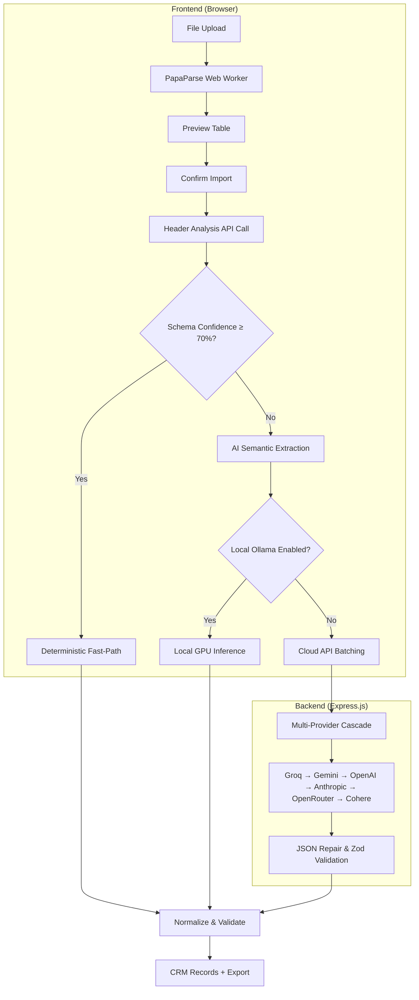

<p align="center">
  <h1 align="center">GridSense</h1>
  <p align="center"><strong>AI-Powered CSV → CRM Data Extraction Engine</strong></p>
  <p align="center">
    <a href="https://nextjs.org/"></a>
    <a href="https://expressjs.com/"></a>
    <a href="https://tailwindcss.com/"></a>
    <a href="https://www.typescriptlang.org/"></a>
  </p>
</p>

> Drop any CSV — Facebook leads, Google Ads exports, real estate CRMs, messy spreadsheets — and the AI will automatically extract and map every field into GrowEasy's CRM schema.

🔗 **Live Demo:** [grid-sense-ge.vercel.app](https://grid-sense-ge.vercel.app)

---

## Table of Contents

- [The Problem](#the-problem)
- [How It Works](#how-it-works)
- [Key Features](#key-features)
- [Tech Stack](#tech-stack)
- [Setup Instructions](#setup-instructions)
- [Environment Variables](#environment-variables)
- [Local AI (Ollama)](#local-ai-ollama)
- [Running Tests](#running-tests)
- [Docker](#docker)
- [Architecture](#architecture)
- [Engineering Decisions](#engineering-decisions)
- [AI Acknowledgements](#ai-acknowledgements)

---

## The Problem

CRM data ingestion is brittle. Users export leads from Facebook, Google Ads, Zoho, HubSpot, or hand-made Excel sheets — each with different column names, date formats, and layouts. Traditional parsers break the moment a header changes from `"Full Name"` to `"First"` + `"Last"`, or when a phone number is buried inside a notes column.

**GridSense solves this.** Upload *any* CSV, and the AI will intelligently map it to the strict 15-field GrowEasy CRM schema — automatically.

---

## How It Works

```
Upload CSV  →  Client-side parsing  →  AI header analysis  →  Deterministic or AI extraction  →  Normalized CRM records
```

1. **Upload** — Drag & drop or file picker. Parsed entirely in the browser via a Web Worker (no data leaves your machine during parsing).
2. **Preview** — See your raw data in a paginated, sticky-header table. No AI processing yet.
3. **Confirm** — Click "Start AI Extraction". The system analyzes your column headers to determine the fastest extraction strategy.
4. **Results** — View extracted CRM records, skipped rows with reasons, and export as CSV or JSON.

---

## Key Features

| Category | Feature |
|----------|---------|
| **Upload** | Drag & Drop, File Picker, 10+ sample datasets included |
| **Preview** | Paginated table, sticky headers, horizontal/vertical scrolling |
| **AI Extraction** | Multi-provider fallback cascade (Groq → Gemini → OpenAI → Anthropic → OpenRouter → Cohere) |
| **Smart Routing** | Deterministic fast-path for high-confidence mappings, AI only when needed |
| **Resilience** | Automatic retries, exponential backoff, batch splitting on rate limits, circuit breaker |
| **Local AI** | Ollama integration for 100% offline, privacy-first inference |
| **Results** | Export CSV/JSON, copy JSON, row-level clipboard, skipped/failed row inspectors |
| **UX** | Dark mode, animated progress, real-time activity logs, ETA countdown, keyboard shortcuts |
| **Validation** | Zod runtime boundaries, JSON repair for truncated AI responses, enum enforcement |
| **DevOps** | Docker & Docker Compose, Vercel deployment config, unit tests (Vitest), Husky + lint-staged |

---

## Tech Stack

| Layer | Technology |
|-------|-----------|
| **Frontend** | Next.js 16, React 19, Tailwind CSS v4, Framer Motion, TanStack Table, Shadcn/Base UI |
| **Backend** | Node.js, Express.js, TypeScript, Zod validation |
| **AI Providers** | Groq (LLaMA 3.1 8B), Google Gemini 1.5 Flash, OpenAI GPT-4o-mini, Anthropic Claude 3.5 Haiku, OpenRouter, Cohere, Ollama (local) |
| **Testing** | Vitest, Supertest |
| **DevOps** | Docker, Docker Compose, Vercel, Husky, lint-staged, Prettier, ESLint |

---

## Setup Instructions

### Prerequisites
- **Node.js** v18+
- **npm** (comes with Node.js)

### 1. Clone & Install

```bash
# Clone the repository
git clone https://github.com/notUbaid/GridSense.git
cd GridSense

# Install root dependencies (monorepo scripts)
npm ci

# Install backend dependencies
cd backend
npm ci
cd ..

# Install frontend dependencies
cd frontend
npm ci
cd ..
```

### 2. Configure Environment

```bash
# Copy the example environment file into the backend folder
cp .env.example backend/.env
```

Edit `backend/.env` and add your API keys (see [Environment Variables](#environment-variables)).

### 3. Run Development Servers

```bash
# From the project root — starts both frontend and backend concurrently
npm run dev
```

- **Frontend**: http://localhost:3000
- **Backend**: http://localhost:8000
- **Health Check**: http://localhost:8000/health

---

## Environment Variables

Configure these in `backend/.env`:

| Variable | Required | Description |
|----------|----------|-------------|
| `GROQ_API_KEY` | **Yes** (or any one provider) | Free at [console.groq.com](https://console.groq.com). Supports comma-separated keys for rotation. |
| `GEMINI_API_KEY` | Recommended | Free at [aistudio.google.com](https://aistudio.google.com). Used as fallback. |
| `OPENAI_API_KEY` | Optional | Falls back after Gemini. |
| `ANTHROPIC_API_KEY` | Optional | Falls back after OpenAI. |
| `OPENROUTER_API_KEY` | Optional | Falls back after Anthropic. |
| `COHERE_API_KEY` | Optional | Falls back after OpenRouter. |
| `FRONTEND_URL` | No | CORS origin. Defaults to `http://localhost:3000`. |
| `AI_MAX_RETRIES` | No | Max retry attempts per batch. Default: `3`. |
| `AI_RETRY_DELAY_MS` | No | Base retry delay in ms (exponential backoff). Default: `2000`. |

> **Tip:** You only need *one* API key to get started. Groq offers a generous free tier with LLaMA 3.1 8B Instant.

---

## Local AI (Ollama)

For fully offline, privacy-first extraction:

1. Install [Ollama](https://ollama.com/) and pull a model:
   ```bash
   ollama pull gemma3:latest
   ```

2. Start Ollama with CORS enabled:

   **macOS / Linux:**
   ```bash
   OLLAMA_ORIGINS="*" ollama serve
   ```
   **Windows (PowerShell):**
   ```powershell
   $env:OLLAMA_ORIGINS="*"
   ollama serve
   ```

3. In the GridSense UI, click the **CPU icon** (top right) to activate local inference. All extraction routes through your local hardware — no data leaves your machine.

---

## Running Tests

```bash
# Backend unit tests (8 tests across 3 suites)
cd backend
npm run test
```

Tests use a mock AI provider to ensure deterministic execution without consuming API tokens.

---

## Docker

### Docker Compose (recommended)

```bash
docker compose up --build
```

This starts both the backend (port 8000) and frontend (port 3000) with health checks.

### Individual Docker Build

```bash
docker build -t gridsense .
```

---

## Architecture



### Key Data Flow

1. **CSV Parsing** — Happens entirely in the browser via PapaParse Web Worker. The backend never receives the raw file.
2. **Header Mapping** — A lightweight AI call maps CSV column names to CRM schema fields with confidence scores.
3. **Batch Processing** — Rows are chunked (20 for AI, 5000 for deterministic) and processed concurrently with adaptive throttling.
4. **Normalization** — Every record passes through deterministic validation: email regex, phone formatting, country code extraction, enum enforcement.

---

## Engineering Decisions

### Hybrid Deterministic/AI Extraction
Sending every row to an LLM is slow, expensive, and unreliable. Instead, we first analyze headers. If the AI confidently maps them (≥70% confidence), we skip the LLM entirely and use deterministic field mapping — processing thousands of rows in milliseconds.

### JSON Repair Pipeline
LLMs sometimes return truncated JSON, markdown fences, or integers where strings are expected. Our `salvageExtractorJson` + `repairTruncatedJson` utilities handle all of this transparently, recovering partial responses instead of failing the entire batch.

### Adaptive Concurrency
The frontend dynamically scales concurrent batch requests (1–20 workers) based on success/failure signals. On rate limits, concurrency halves. On success, it increments. This maximizes throughput without overwhelming free-tier API limits.

### Multi-Key Rotation
Each provider supports comma-separated API keys. When one key hits its rate limit, it's marked as exhausted and restored after a 60-second TTL. The system round-robins through available keys automatically.

---

## AI Acknowledgements

In the spirit of transparency, this project leveraged AI tooling throughout development:

1. **Antigravity IDE** — Core development assistance and architectural scaffolding.
2. **Claude (Anthropic)** — Quality checks, edge-case analysis, and logic validation.
3. **ChatGPT (OpenAI)** — Prompt optimization for local Ollama inference and synthetic test data generation.

---

## Submission

- **Position Applied For:** Intern

---

*Built for the GrowEasy Software Developer Evaluation.*
