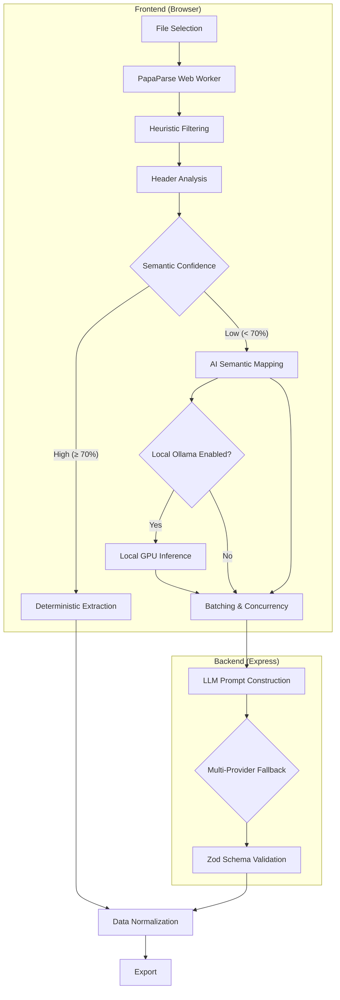

# GridSense

[](https://nextjs.org/)
[](https://expressjs.com/)
[](https://tailwindcss.com/)
[](https://www.typescriptlang.org/)

**GridSense** is an intelligent, hybrid AI data ingestion pipeline. It seamlessly maps messy, unstructured CSV files into a strictly typed CRM schema, bridging the gap between volatile user-generated data and strict backend validation requirements.

---

## The Problem

CRM data migration fundamentally suffers from format volatility. End-users export data from disparate sources (Facebook Lead Ads, Google Ads, legacy CRM systems, manual spreadsheets). These exports yield arbitrary column headers, inconsistent date formats, embedded newlines, and scattered contact information.

Traditional fixed-schema CSV importers fail because they require strict column mapping. When headers change or columns are merged (e.g., "Full Name" instead of "First" and "Last"), deterministic parsers drop the data or force manual user intervention.

## The Solution

GridSense approaches data ingestion by combining **deterministic software engineering** with **semantic AI extraction**.

Instead of relying entirely on fragile regular expressions or trusting an LLM with raw, unconstrained output, the system uses AI exclusively as a semantic translation layer. Hard constraints are applied before and after the LLM execution. Deterministic logic handles file parsing, chunking, validation, and serialization. The AI is only invoked to semantically map unknown column headers to the target schema, isolating non-deterministic behavior to a single, easily observable boundary.

## Key Features

- **Local Privacy-First AI (Ollama)**: Execute LLM extraction locally on your own hardware at zero cost, ensuring strict data privacy.
- **Dynamic Cloud Fallback**: Automatically cascades across cloud AI providers (Groq, Gemini, OpenRouter) if local models are unavailable or rate-limited.
- **Client-Side Chunking**: Leverages Web Workers to parse and chunk massive CSVs directly in the browser, preventing server memory bloat.
- **Zod Schema Boundaries**: All LLM outputs are stripped of markdown and piped through strictly typed Zod schemas to guarantee data integrity.
- **Resilient Retry Logic**: Automatically catches `429 Too Many Requests` or `503 Service Unavailable` errors, splits failed batches, and cycles to the next available AI engine.

---

## Using Local AI (Ollama)

GridSense supports **100% local, zero-cost data extraction** using [Ollama](https://ollama.com/). This allows you to process highly sensitive CRM data without ever sending it to a cloud provider.

### Setup Instructions

1. Install and start [Ollama](https://ollama.com/) on your local machine.
2. Download your preferred model. We recommend `gemma3` or `llama3`:
   ```bash
   ollama run gemma3:latest
   ```
3. **CRITICAL: Enable CORS**
   Because modern web browsers block cross-origin requests for security, you MUST launch Ollama with CORS permissions enabled so the GridSense web app can communicate with your local daemon.

   **On macOS/Linux:**
   ```bash
   OLLAMA_ORIGINS="*" ollama serve
   ```
   
   **On Windows (PowerShell):**
   ```powershell
   $env:OLLAMA_ORIGINS="*"
   ollama serve
   ```
4. Open the GridSense app, click the **Microchip Icon** (Local AI Toggle) in the top right corner to activate local inference.

When enabled, the browser will seamlessly intercept AI requests, send the prompts to your local GPU, and relay the mapped data back to the server for strict validation. If Ollama is turned off or unreachable, GridSense will transparently failover to cloud providers.

---

## Architecture



## Engineering Decisions

- **Why batching?** Passing a 10,000-row CSV into an LLM context window results in immediate failure due to token limits or severe degradation in instruction adherence. Chunking into small 20-50 row batches ensures high mapping accuracy.
- **Why client-side chunking?** Offloading the initial parsing and chunking to the client prevents the backend from managing large, stateful file uploads. The backend remains stateless.
- **Why multi-provider retries?** Relying on a single free-tier AI API guarantees failure during load spikes. The cascade fallback system allows the pipeline to gracefully recover without surfacing the failure to the user.
- **Why Zod?** The pipeline requires a runtime guarantee that the AI output matches the TypeScript interfaces. Zod enforces this boundary, stripping invalid keys and coercing types before the data re-enters the deterministic pipeline.

## Local Development

The project operates as a monorepo containing both the Next.js client and Express.js server.

```bash
# Clone the repository
git clone https://github.com/notUbaid/GridSense.git
cd GridSense

# Install dependencies across the monorepo
npm ci
cd frontend && npm ci
cd backend && npm ci

# Copy environment variables
cp .env.example .env
```

To run both servers concurrently:
```bash
npm run dev
```

### Environment Variables
Production cloud deployments require the following secrets in `.env`:
- `GROQ_API_KEY`
- `GEMINI_API_KEY`
- `OPENAI_API_KEY` (Optional)
- `ANTHROPIC_API_KEY` (Optional)

*(Note: No API keys are required if you exclusively use Local Ollama).*

## Testing

The backend includes a Vitest suite designed to validate the extraction logic without consuming live API tokens. The test environment utilizes a mocked AI provider to ensure deterministic execution of the pipeline.

```bash
npm run test:backend
```

---
*Built for the GrowEasy Software Developer Internship Evaluation.*
